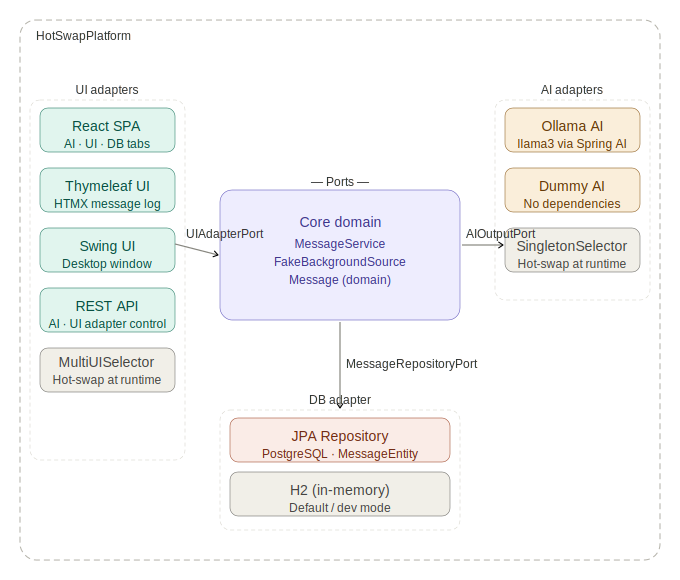
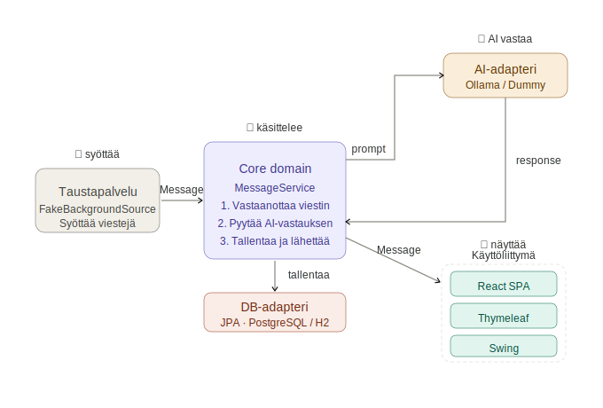

# HotSwap Platform

A portfolio project demonstrating **hexagonal architecture** with runtime-swappable adapters built on Spring Boot 4 and Java 25.

AI models, databases, and UI adapters can be switched while the application is running — without restarting or modifying core logic.

## Architecture

## Data flow

## Repositories

| Repository | Description |
|------------|-------------|
| [hotswap-platform-core](https://github.com/HotSwapPlatform/hotswap-platform-core) | Spring Boot backend — hexagonal architecture, ports and adapters, Spring AI, TDD |
| [hotswap-platform-ui](https://github.com/HotSwapPlatform/hotswap-platform-ui) | React + TypeScript management console — adapter control, real-time status polling |

## Author

**Ilkka Nieminen**
- GitHub: [github.com/ilkka-n](https://github.com/ilkka-n)
- LinkedIn: [linkedin.com/in/ilkka-n](https://www.linkedin.com/in/ilkka-n/)
